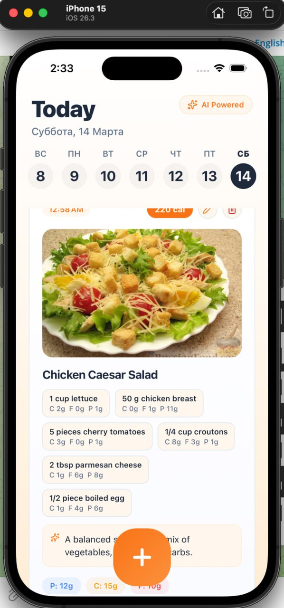

# Cali - AI Meal Logging App

Cali is a mobile-first food logging app that lets users quickly log meals from photos, review detected ingredients/macros, and track nutrition over time.

## What the app does

- Fast photo-based food logging
- AI-powered nutrition analysis (ingredients, carbs, fats, protein, calories)
- Async log processing flow for reliable background analysis
- Profile and auth flows via Supabase
- Daily timeline style UI for meal history

## Screenshots

### Meal card example



### Branding


## Tech stack

- `React Native` + `Expo` + `Expo Router`
- `TypeScript`
- Supabase (auth/profile/data)
- FastAPI backend for AI food analysis
- OpenAI-based vision + nutrition pipeline

## Project structure

```text
app/                 # Expo Router screens
backend/             # FastAPI API and AI service
constants/           # Shared app constants/types
contexts/            # React contexts (auth, app state)
hooks/               # Custom hooks
lib/                 # Frontend API/AI integration helpers
supabase/            # SQL migrations
assets/images/       # App images/icons
```

## Local development

### Frontend

```bash
bun i
bun run start
```

### Backend

```bash
cd backend
python3 -m pip install -r requirements.txt
python3 -m uvicorn app.main:app --reload --host 0.0.0.0 --port 8000
```

## Environment

- Frontend points to backend via `EXPO_PUBLIC_BACKEND_URL`
- Backend requires `OPENAI_API_KEY`
- Supabase client config is required for auth/profile features

## Useful scripts

| Command | Description |
|---|---|
| `bun run start` | Start Expo dev server |
| `bun run start-web` | Start web dev preview |
| `bun run lint` | Run lint checks |

## Testing

Backend tests:

```bash
cd backend
python3 -m pytest tests/ -v
```
